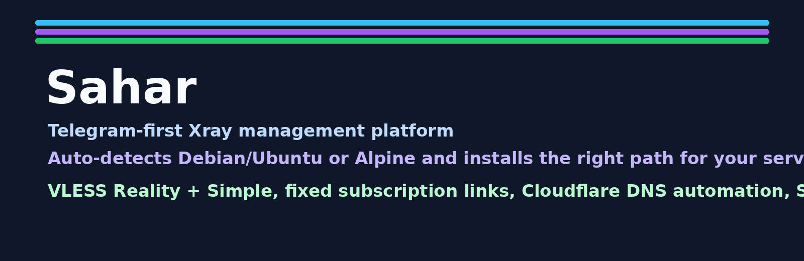
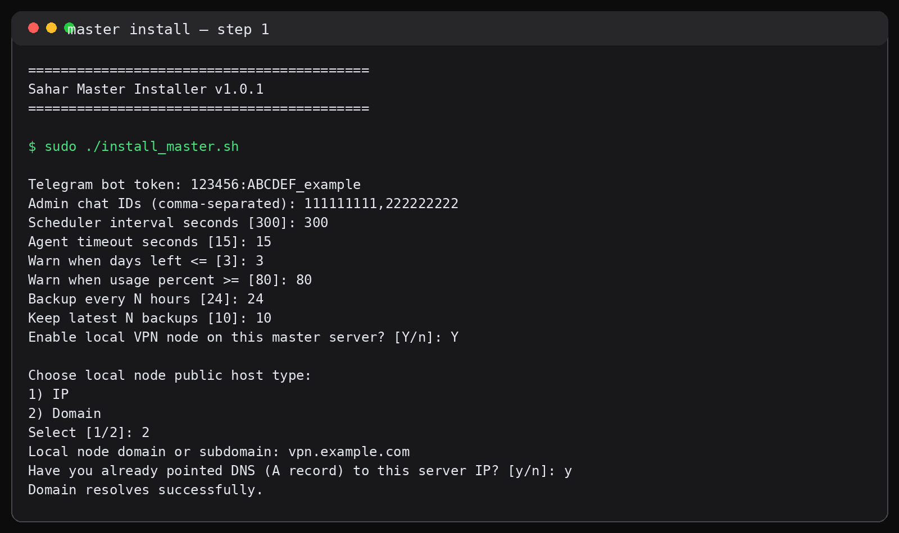
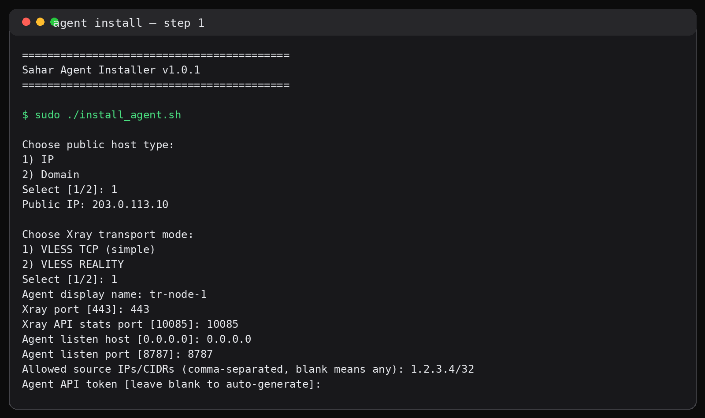

# Sahar v0.1.15



**Telegram-first Xray management platform**  
مدیریت Xray / VLESS با پنل تلگرام، مستر و ایجنت، سابسکریپشن ثابت، DNS خودکار و نصب هوشمند روی سیستم‌عامل مناسب.


> ✨ **نکته مهم:** نصب‌کننده به‌صورت **خودکار سیستم‌عامل را تشخیص می‌دهد** و اگر سرور شما **Ubuntu / Debian** یا **Alpine** باشد، بدون اینکه لازم باشد چیزی انتخاب کنید، مسیر نصب مناسب همان سیستم‌عامل را جلو می‌برد.

> 💚 این پروژه را با عشق و احترام، به یاد **سحر عزیزم** تقدیم می‌کنم؛ کسی که برای آرمان آزادی، جانِ گران‌قدرش را فدا کرد و یادش همیشه زنده خواهد ماند.

---

## 🎯 Sahar دقیقاً چه کاری انجام می‌دهد؟

Sahar یک سیستم مدیریت **Xray / VLESS** با محوریت **Telegram** است. این پروژه به شما کمک می‌کند:

- یک **Master Server** برای کنترل کل سیستم داشته باشید
- روی همان Master در صورت نیاز **Local Node** فعال کنید
- هر زمان خواستید **Agent** روی سرورهای دیگر اضافه کنید
- برای هر کاربر **Subscription ثابت** بسازید
- دسترسی هر کاربر را به:
  - یک سرور
  - چند سرور
  - یا همه سرورها
  مدیریت کنید
- روی هر سرور این دو پروفایل را نگه دارید:
  - `VLESS | Reality`
  - `VLESS | Simple`
- از **Cloudflare** برای ساخت خودکار ساب‌دامنه و رکورد DNS هر نود استفاده کنید
- از داخل تلگرام:
  - کاربر بسازید
  - زمان و حجم بدهید
  - سرور اضافه کنید
  - از طریق SSH ایجنت را روی VPS جدید نصب کنید
  - سلامت سرورها، خطاها و لاگ‌ها را ببینید

به زبان خیلی ساده:

- **Master = مغز سیستم**
- **Agent = اجراکننده روی هر VPS**
- **Telegram Bot = پنل مدیریت شما**

---

## 🧠 معماری پروژه

### 1) Master
Master این سرویس‌ها و ماژول‌ها را دارد:

- Telegram Bot
- SQLite Database
- Subscription Service
- Scheduler
- Backup Manager
- Cloudflare Manager
- Provisioner برای اضافه‌کردن Agent با SSH

Master می‌تواند:
- فقط نقش مدیریتی داشته باشد
- یا خودش هم به عنوان **Local Node** استفاده شود

### 2) Agent
Agent روی هر VPS اجرا می‌شود و این کارها را انجام می‌دهد:

- نصب و اجرای Xray
- ساخت و حذف کاربر در Xray
- فعال / غیرفعال کردن کاربر
- ریستارت Xray
- برگرداندن آمار مصرف
- برگرداندن سلامت نود
- پاسخ به Master از طریق API

---

## 🗂️ ساختار فایل‌ها

```text
install_master.sh
install_agent.sh
master_app/
  agent_client.py
  backup_manager.py
  bootstrap_cloudflare.py
  bot.py
  cloudflare_manager.py
  db.py
  error_tools.py
  notifier.py
  provisioner.py
  register_local_server.py
  requirements.txt
  scheduler.py
  subscription_api.py
  utils.py
agent_app/
  agent_api.py
  requirements.txt
  utils.py
  xray_manager.py
assets/
  banner.png
  master-install.png
  agent-install.png
VERSION
LICENSE
README.md
```

---

## 🖼️ نمای نصب

### نصب Master
<p align="center">
  
</p>

### نصب Agent
<p align="center">
  
</p>

---

## 🚀 نصب سریع

### اگر فقط یک VPS داری
فقط **Master** را نصب کن و در مرحله نصب، **Local Node** را فعال کن.

```bash
unzip sahar_0.1.15_auto_os.zip
cd sahar_0.1.15_auto_os
sudo bash install_master.sh
```

وقتی اسکریپت سؤال کرد:

```text
Enable local VPN node on this master server? [Y/n]
```

جواب بده:

```text
Y
```

در این حالت همان VPS هم:
- Master می‌شود
- هم Xray دارد
- هم Local Agent دارد

---

### اگر چند VPS داری
روی سرور اصلی:

```bash
sudo bash install_master.sh
```

روی هر سرور اضافه:

```bash
sudo bash install_agent.sh
```

---

## 🐧 نصب هوشمند روی سیستم‌عامل‌های مختلف

Sahar در زمان نصب، خودش این را تشخیص می‌دهد:

- **Ubuntu / Debian**
- **Alpine**

و بعد پشت صحنه با ابزار مناسب همان سیستم جلو می‌رود:

- روی **Debian/Ubuntu**
  - `apt`
  - `systemd`

- روی **Alpine**
  - `apk`
  - `OpenRC`

یعنی لازم نیست شما چیزی انتخاب کنی؛ اسکریپت خودش تشخیص می‌دهد و نصب را ادامه می‌دهد.

---

## ☁️ Cloudflare DNS Automation

اگر موقع نصب Master، Cloudflare را فعال کنی:

- نام دامنه می‌گیرد
- `Base subdomain` اختیاری می‌گیرد
- API Token را ذخیره می‌کند
- برای هر سرور جدید:
  - یک ساب‌دامنه می‌سازد
  - رکورد DNS می‌سازد
  - آن را به IP سرور وصل می‌کند

مثال:

- Domain name: `example.com`
- Base subdomain: `vpn`
- Server name: `ir1`

خروجی:

```text
ir1.vpn.example.com
```

اگر بعداً سرور را از تلگرام حذف کنی:
- رکورد DNS هم پاک می‌شود

---

## 🔐 نقش‌های ادمین

سیستم از چند نقش پشتیبانی می‌کند:

- `owner`
- `admin`
- `support`
- `viewer`

و برای عملیات حساس، تأیید دومرحله‌ای دارد.

---

## 👥 کاربر چه چیزی دریافت می‌کند؟

برای هر کاربر یک **Subscription Link ثابت** ساخته می‌شود.

یعنی:
- لینک کاربر عوض نمی‌شود
- اگر سرور جدید اضافه شود، همان لینک update می‌شود
- اگر سرور حذف شود، باز همان لینک می‌ماند
- فقط محتوای subscription تغییر می‌کند

داخل این subscription برای هر سرور مجاز، این پروفایل‌ها می‌آیند:

- `VLESS | Reality`
- `VLESS | Simple`

---

## 🤖 از داخل تلگرام چه کارهایی می‌شود کرد؟

از داخل Telegram Bot می‌توانی:

- کاربر بسازی
- کاربر حذف کنی
- کاربر را فعال / غیرفعال کنی
- زمان و حجم بدهی
- کریدیت بدهی یا کم کنی
- پلن و یادداشت تنظیم کنی
- سرور اضافه کنی
- سرور را با **SSH Provisioning** نصب کنی
- سرور حذف کنی
- Subscription کاربر را بگیری
- QR بگیری
- گزارش سلامت سرورها را ببینی
- خطاهای اخیر را ببینی
- بکاپ بگیری
- وضعیت Xray را چک کنی

---

## 🔌 افزودن Agent با SSH

یکی از قابلیت‌های مهم Sahar این است که از داخل تلگرام می‌توانی سرور جدید را با SSH اضافه کنی.

بات این اطلاعات را از تو می‌گیرد:
- IP یا Host
- SSH Port
- Username
- Password

بعد Master:
- با SSH به VPS وصل می‌شود
- فایل‌های Agent را منتقل می‌کند
- نصب را اجرا می‌کند
- Agent را بالا می‌آورد
- health check می‌گیرد
- سرور را در دیتابیس ثبت می‌کند
- و اگر Cloudflare روشن باشد، ساب‌دامنه را هم می‌سازد

---

## 🛠️ سرویس‌هایی که بعد از نصب باید بالا باشند

### روی Master
اگر با systemd باشد:

```bash
systemctl status sahar-master-bot
systemctl status sahar-master-scheduler
systemctl status sahar-master-subscription
```

اگر Local Node فعال باشد:

```bash
systemctl status sahar-master-local-agent
systemctl status xray
```

روی Alpine / OpenRC:

```bash
rc-service sahar-master-bot status
rc-service sahar-master-scheduler status
rc-service sahar-master-subscription status
rc-service xray status
```

### روی Agent
Debian/Ubuntu:

```bash
systemctl status sahar-agent
systemctl status xray
```

Alpine:

```bash
rc-service sahar-agent status
rc-service xray status
```

---

## 📜 لاگ و عیب‌یابی

### روی Debian/Ubuntu
```bash
journalctl -u sahar-master-bot -n 100 --no-pager
journalctl -u sahar-master-scheduler -n 100 --no-pager
journalctl -u sahar-master-subscription -n 100 --no-pager
journalctl -u sahar-agent -n 100 --no-pager
journalctl -u xray -n 100 --no-pager
```

### روی Alpine
```bash
tail -n 100 /opt/sahar-master/logs/*.log
tail -n 100 /opt/sahar-agent/logs/*.log
```

---

## 📦 حداقل سخت‌افزار پیشنهادی

### Master فقط مدیریتی
- 1 vCPU
- 1 GB RAM
- 10 GB SSD

### Master + Local Node
- 2 vCPU
- 2 GB RAM
- 20 GB SSD

### Agent
- 1 vCPU
- 1 GB RAM
- 10 GB SSD

---

## ✅ اجرای خیلی کوتاه برای دوستانی که از GitHub می‌گیرند

اگر پروژه را روی GitHub با نام کاربری **PooyanGhorbani** بگذاری، راه خیلی کوتاه نصب برای دوستانت می‌تواند این باشد:

```bash
git clone https://github.com/PooyanGhorbani/sahar.git
cd sahar
sudo bash install_master.sh
```

اگر بخواهند روی سرور اضافه Agent نصب کنند:

```bash
git clone https://github.com/PooyanGhorbani/sahar.git
cd sahar
sudo bash install_agent.sh
```

---

## ⚠️ نکات امنیتی مهم

- Cloudflare API Token را با حداقل دسترسی بساز:
  - `Zone Read`
  - `DNS Write`
- بهتر است بعداً provisioning با **SSH Key** را هم فعال کنی
- برای استفاده واقعی، بعد از نصب حتماً سلامت این موارد را چک کن:
  - Telegram Bot
  - Xray
  - Agent API
  - Subscription
  - DNS

---

## ❤️ آخر حرف
Sahar طوری طراحی شده که مدیریت Xray را از حالت پراکنده و دستی خارج کند و همه‌چیز را به یک پنل منظم تلگرامی تبدیل کند؛ با قابلیت رشد از یک VPS ساده تا چند نود کامل.

اگر خواستی مرحله‌به‌مرحله واقعی جلو بروی، فقط کافی است فایل پروژه را روی سرور بگذاری و `install_master.sh` را اجرا کنی.
